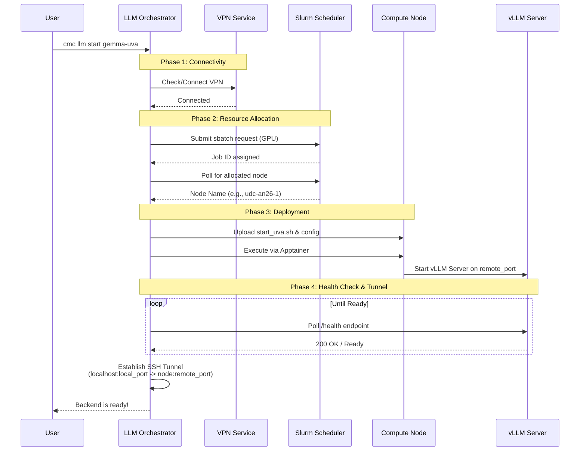
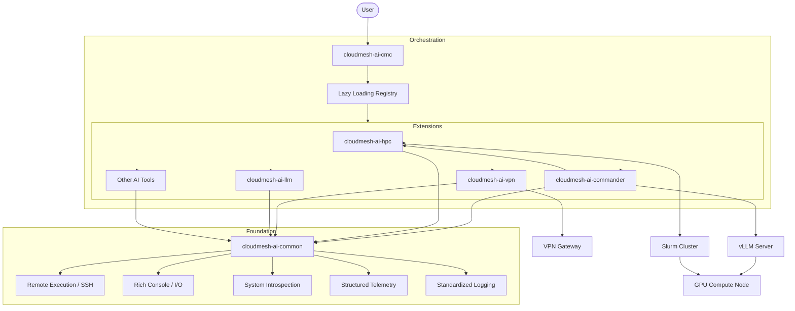

# Impact of Cloudmesh AI LLM Orchestrator

Gregor von Laszewski (laszewski@gmail.com)

* Status: Draft

## Acknowledgments

This document was synthesized using extensive information provided within the project's code and document repository. **Gemma 4** was utilized to digest this technical context and generate specific answers to a series of detailed inquiries regarding the project's impact and relevance.

Additionally, it is acknowledged that:
- **cloudmesh-ai-vpn** was ported from UFL to Windows by **JP Fleischer**.
- **Gemma 4** was used in the coding and iterative improvement of the software from its earlier versions.
- The images were genrated by Gemini based on information provided by the author.

## Real-World Relevance

This work solves the "last mile" problem of deploying powerful AI models on specialized, high-security infrastructure, which is critical for several reasons:

- **Data Sovereignty & Privacy (Policy):** In fields like healthcare, government, and defense, sending sensitive data to public APIs is often a policy violation. This orchestrator enables the use of state-of-the-art AI while keeping data entirely within a secure, private perimeter.
- **Infrastructure Accessibility:** It democratizes access to massive GPU resources (DGX, HPC) by automating the "infrastructure nightmare"—VPNs, Slurm allocations, and SSH tunneling—turning a complex manual process into a single command.
- **Research Velocity (Health & Science):** By reducing the time from "requesting a GPU" to "interacting with a model" from hours to seconds, it allows researchers to focus on discovery rather than environment configuration.

---

## Unique Impact and Value

What makes this work unique and impactful is not the creation of a new AI model, but the creation of a **high-velocity orchestration layer** that bridges the gap between raw supercomputing hardware and usable AI tools.

### Unique Impact Vectors:

**1. Method: The "Zero-to-Model" Pipeline**
Most AI deployment tools assume the infrastructure is already ready. This work is unique because it orchestrates the *entire* prerequisite chain. It treats the VPN, the Slurm GPU scheduler, the SSH tunnel, and the container runtime as a single atomic operation. This "unified pipeline" removes the fragmented manual steps that typically frustrate researchers and engineers.

**2. Speed: Drastic Reduction in Setup Latency**
The primary impact is the collapse of "time-to-interaction." What previously required a manual checklist of 7-10 technical steps (connecting VPN $\rightarrow$ requesting node $\rightarrow$ checking allocation $\rightarrow$ SSHing $\rightarrow$ starting container $\rightarrow$ verifying port $\rightarrow$ setting up tunnel) is now a single command. This transforms the deployment process from a "project" into a "utility."

**3. Flexibility: The "Export-and-Override" Pattern**
Unlike many "black-box" orchestrators, this system uses a hybrid script-driven approach. The ability to `--export` the launch scripts allows power users to maintain granular control over vLLM flags (like GPU memory utilization or max model length) while still benefiting from the orchestrator's automation. It provides the ease of a GUI with the precision of a CLI.

**4. Scale: Hardware Abstraction**
The system provides a consistent interface across wildly different computing environments. Whether the model is running on a local workstation, a dedicated DGX cluster, or a shared University HPC, the user experience remains identical. This abstraction allows teams to scale their workloads from local testing to supercomputer-grade production without changing their workflow.

**5. Decision-Support: Tooling Integration**
By providing first-class launchers for **Aider** and **Claude Code**, the project moves beyond "hosting a model" to "enabling an agent." It turns a remote GPU into a local AI pair-programmer, directly impacting the speed and quality of software development.

**Summary of Impact:**
The impact is **operational efficiency**. It converts complex, specialized infrastructure into a plug-and-play resource, ensuring that the bottleneck for AI innovation is the *idea*, not the *infrastructure*.

---

## New Capabilities for BI

By leveraging the `cloudmesh-ai-llm` orchestrator and the broader Cloudmesh AI ecosystem, we can offer the following new capabilities to other researchers and teams at BI:

### 1. "Private-AI-as-a-Service" (Tools & Models)
We can provide a turnkey solution for teams to run state-of-the-art LLMs (e.g., Gemma-4) without them needing to manage the underlying infrastructure.
*   **On-Demand Model Deployment:** We can offer a service where teams can request a specific model, and we provide them with a secure API endpoint hosted on BI's DGX or HPC clusters.
*   **Secure Web Interfaces:** By deploying **Open WebUI** as a front-end, we can offer a "BI-Internal ChatGPT" experience—allowing users to interact with powerful models via a browser while ensuring no data ever leaves the BI network.

### 2. AI-Accelerated Research Coding (Tools & Methods)
We can introduce a new standard for how research software is developed at BI.
*   **Agentic Coding Environments:** We can provide pre-configured environments integrating **Aider** and **Claude Code** with our private backends. This allows researchers to use AI pair-programmers that have direct access to their local git repos but use secure, internal LLMs for the intelligence.
*   **Standardized Deployment Methods:** We can offer the "Unified Pipeline" method to other labs, helping them move their own AI workloads from local prototypes to HPC-scale production in minutes rather than days.

### 3. Secure Data-AI Sandboxes (Methods & Infrastructure)
We can offer a framework for handling highly sensitive datasets that cannot be uploaded to the cloud.
*   **Air-Gapped AI Workflows:** We can provide the methodology and tooling to set up "secure sandboxes" where models are deployed on isolated nodes, allowing for the analysis of sensitive health or policy data with zero external leakage.
*   **Hybrid-Cloud Routing:** We can offer a method to route non-sensitive tasks to public APIs and sensitive tasks to internal HPC models, optimizing for both cost and security.

### 4. Performance & Resource Insights (Dashboards & Data)
As the orchestrator matures, we can provide institutional visibility into AI resource usage.
*   **GPU Utilization Dashboards:** We can offer dashboards showing the efficiency and load of AI models across the BI clusters, helping the organization make data-driven decisions about future hardware investments.
*   **Model Benchmarking Data:** We can provide a shared library of performance benchmarks (latency, throughput, accuracy) for different models on BI's specific hardware, helping other researchers choose the right model for their specific task.

**Summary of Value to BI:**
We are moving from providing **raw hardware** (GPUs) to providing **functional AI capabilities**. Instead of giving a researcher a "node," we are giving them a "secure, intelligent assistant" integrated directly into their workflow.

---

## Acceleration Resources

To further accelerate the development and impact of the `cloudmesh-ai-llm` orchestrator, the following resources would be most valuable:

### 1. Specialized Expertise
*   **HPC & Slurm Optimization:** Experts in High-Performance Computing (HPC) to optimize GPU allocation scripts and handle complex cluster-specific edge cases.
*   **Network Engineering:** Expertise in secure tunneling and mesh networking (e.g., WireGuard) to evolve the connectivity layer beyond SSH tunnels.
*   **Inference Engine Tuning:** vLLM specialists to build a library of "optimal defaults" for various model sizes and hardware profiles.

### 2. Critical Data
*   **Cross-Platform Performance Benchmarks:** A dataset of startup times and inference latencies across different environments (UVA HPC vs. DGX vs. Local) to eliminate bottlenecks.
*   **User Configuration Patterns:** Anonymized data on how users structure their `llm.yaml` files to identify common pain points and automate frequent configurations.
*   **Hardware-Model Compatibility Matrix:** Data mapping specific model versions to the most efficient hardware configurations.

### 3. Advanced Tooling
*   **Real-time Observability:** Integration with monitoring tools like Prometheus and Grafana for live visibility into GPU health and model loading.
*   **HPC Simulation Frameworks:** Tools that can simulate Slurm environments to enable a full CI/CD pipeline without consuming expensive GPU credits.
*   **Declarative Infrastructure Tools:** Integration with IaC tools (like Terraform or Ansible) to manage server and container configurations consistently.

## Architecture

The architecture of the system is designed for modularity and scalability. The architecture picture (Figure 1) shows how `cloudmesh-ai-llm` fits into the broader Cloudmesh AI ecosystem. While it is one of many components within the extension layer, it is currently the most essential one, as it provides the critical configuration and management logic for the Large Language Models that power the entire system.

*Figure 1: High-level architecture of the Cloudmesh AI ecosystem, showing the relationship between the central orchestrator, AI extensions, and the common foundation.*

To bridge the gap between the user and the compute resources, the system implements a complex connectivity chain. The deployment topology (Figure 2) illustrates the network and physical connectivity required to access AI services on the HPC cluster, including the necessary VPN gateways and secure tunneling.

*Figure 2: Deployment topology illustrating the network and physical connectivity required to access AI services on the HPC cluster.*

The operational efficiency of the system is best visualized through its execution flow. The system workflow (Figure 3) maps the end-to-end process from the initial user command through the orchestration layer to the final model interaction, demonstrating the collapse of multiple manual steps into a single automated pipeline.

*Figure 3: Operational workflow of the system from user command to model interaction.*

### Detailed Interaction Workflow

To further illustrate the precision of the orchestration, the following sequence diagram (Figure 4) details the interaction between the user, the orchestrator, and the remote HPC infrastructure during a typical deployment (e.g., `cmc llm start gemma-uva`). This process ensures that connectivity, resource allocation, and server health are all verified before the user is notified that the backend is ready.

*Figure 4: Detailed sequence diagram of the automated deployment pipeline, illustrating the coordination between the orchestrator, VPN, Slurm scheduler, and the remote vLLM server.*

### Component Relationship

The following diagram (Figure 0) illustrates the logical flow and dependencies between the system components:

This modular design ensures that the central orchestrator (`cloudmesh-ai-cmc`) remains lightweight by using a lazy-loading registry to activate extensions only when needed. The `cloudmesh-ai-common` foundation provides the essential "plumbing"—such as remote SSH execution and system introspection—that allows the higher-level AI tools to operate consistently across different environments.

**Strategic Value of Modularity:**
This decoupling of the orchestrator from specific LLM implementations and underlying hardware is a critical strategic advantage. It ensures that the organization can seamlessly upgrade to newer, more powerful models or migrate to different GPU clusters without requiring users to learn new tools or change their established workflows, effectively future-proofing the AI infrastructure investment.

---

## References

 **Cloudmesh AI Common:** The core shared library for Cloudmesh AI. [github.com/cloudmesh/cloudmesh-ai-common](https://github.com/cloudmesh/cloudmesh-ai-common)
- **Cloudmesh Common:** The foundational cloud management framework that served as the basis for the code restructuring. [github.com/cloudmesh/cloudmesh-common](https://github.com/cloudmesh/cloudmesh-common)
- **Von Laszewski, G., et al.:** "Towards Experiment Execution in Support of Community Benchmark Workflows for HPC" (arXiv:2507.22294). This paper introduces the concept of "benchmark carpentry" and workflow templates to improve the adaptability and execution of scientific experiments on HPC infrastructure. [arxiv.org/abs/2507.22294](https://arxiv.org/abs/2507.22294)
- **vLLM:** High-throughput and memory-efficient LLM inference and serving. [vllm.ai](https://vllm.ai/)
- **Gemma 4:** Open-weights Large Language Model developed by Google. [ai.google.dev/gemma](https://ai.google.dev/gemma) | [huggingface.co/google](https://huggingface.co/google)
- **Slurm Workload Manager:** Open-source, fault-tolerant and highly scalable cluster management and job scheduling system for large and diverse clusters. [slurm.org](https://slurm.org/)
- **Apptainer:** High-performance container system for HPC. [apptainer.org](https://apptainer.org/)
- **Open WebUI:** A self-hosted, extensible web interface for LLMs. [openwebui.com](https://openwebui.com/)
- **Aider:** AI pair programming in your terminal. [aider.chat](https://aider.chat/)
- **Claude Code:** Agentic CLI tool for coding and system tasks by Anthropic.

