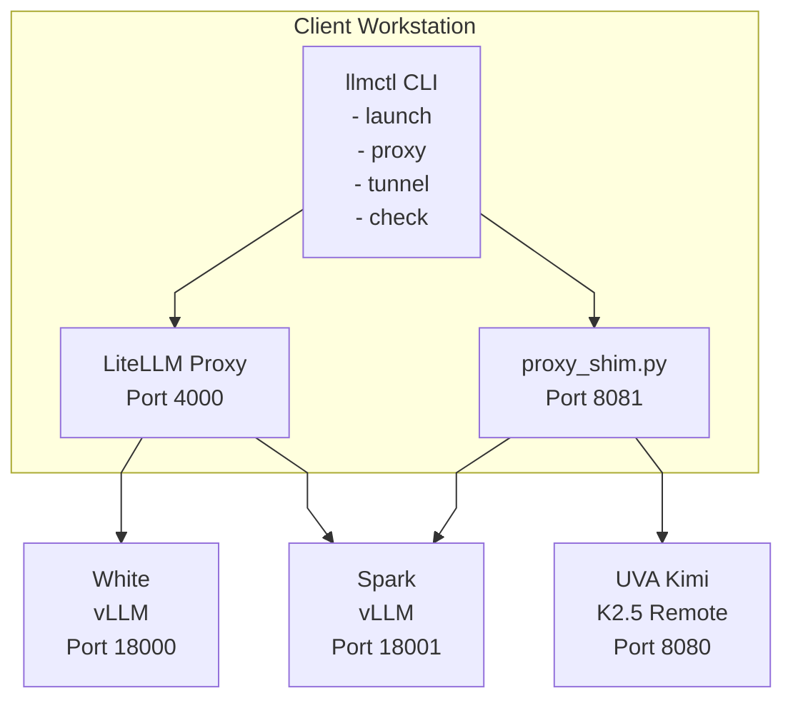
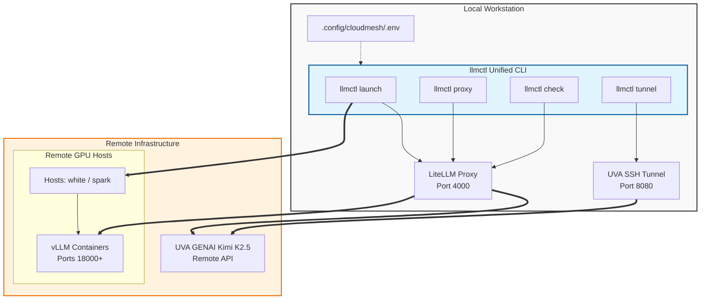
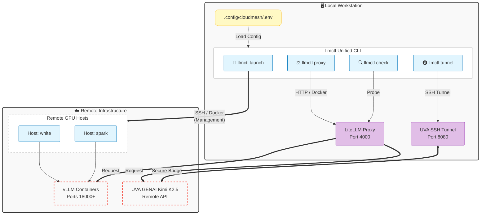

# LLMCTL - Cloudmesh AI LLM CLI

[](https://www.python.org/downloads/) [](https://www.docker.com/) [](LICENSE)

A unified CLI for managing local LLM infrastructure, providing intuitive commands for model launching, proxy management, and remote access to UVA GENAI resources.

------------------------------------------------------------------------

## Quick Start

``` bash
# 1. Install llmctl
pip install -e .

# 2. Verify your setup
llmctl check

# 3. Start the LiteLLM proxy
llmctl proxy start

# 4. Launch a model directly
llmctl launch
```

------------------------------------------------------------------------

## Installation & Setup

### Prerequisites

- **Python 3.8+** with pip
- **Docker** (local and on remote hosts `white` and `spark`)
- **SSH key-based authentication** to hosts `white` and `spark`
- **HuggingFace account** with access token

### 1. Install llmctl

``` bash
cd cloudmesh-ai-llm
pip install -e .
```

This installs the `llmctl` command into your PATH.

### 2. Configure SSH Access

Ensure passwordless SSH works to your hosts:

``` bash
ssh white echo "Connected to white"
ssh spark echo "Connected to spark"
```

Add to `~/.ssh/config` for easier access:

``` ssh-config
Host white
    HostName <white-ip-or-hostname>
    User <username>
    IdentityFile ~/.ssh/id_rsa

Host spark
    HostName <spark-ip-or-hostname>
    User <username>
    IdentityFile ~/.ssh/id_rsa

Host uva
    HostName open-webui.rc.virginia.edu
    User <uva-username>
    LocalForward 8080 open-webui.rc.virginia.edu:443
```

### 3. Setup Secure Credential Storage

Instead of individual files, `llmctl` uses a centralized `.env` file for all credentials.

Create the configuration directory:

``` bash
mkdir -p ~/.config/cloudmesh
chmod 700 ~/.config/cloudmesh
```

Create the `.env` file with your credentials:

``` bash
cat <<EOF > ~/.config/cloudmesh/.env
# HuggingFace token (for downloading models)
HF_TOKEN=your_huggingface_token

# LiteLLM master key (for proxy authentication)
LITELLM_MASTER_KEY=your_secure_random_key

# UVA Kimi key (for remote access)
UVA_KIMI_KEY=your_uva_kimi_key

# OpenAI API key (optional)
OPENAI_API_KEY=your_openai_key
EOF

# Set secure permissions
chmod 600 ~/.config/cloudmesh/.env
```

### 4. Verify Setup

``` bash
llmctl check
```

------------------------------------------------------------------------

## CLI Reference

### `llmctl launch` - Launch Models

Interactive vLLM launcher for remote GPU hosts.

``` bash
# Launch a model interactively
llmctl launch
```

**Features:** - Interactive table-based model selection from `models.yaml` - Automated SSH workflow: kills existing containers, clears ports, pulls images, starts vLLM - Host-specific Docker image selection - Automatic HuggingFace token injection from `~/gemma/HF_token.txt`

### `llmctl proxy` - Manage LiteLLM Proxy

Start, stop, and manage the LiteLLM proxy container.

``` bash
# Start the LiteLLM proxy
llmctl proxy start

# Stop the proxy
llmctl proxy stop

# Check health of all model endpoints
llmctl proxy probe

# View proxy logs
llmctl proxy logs

# Follow logs in real-time
llmctl proxy logs -f
```

**Verifying Proxy Operation:**

``` bash
# List all proxy-managed models
curl http://localhost:4000/v1/models \
  -H "Authorization: Bearer $(cat ~/gemma/server_master_key.txt)"

# Request a chat completion through the proxy
curl http://localhost:4000/v1/chat/completions \
  -H "Content-Type: application/json" \
  -H "Authorization: Bearer $(cat ~/gemma/server_master_key.txt)" \
  -d '{
    "model": "gemma-4-it-white",
    "messages": [{"role": "user", "content": "Explain quantum computing"}]
  }'
```

### `llmctl tunnel` - UVA SSH Tunnel

Manage SSH tunnel for UVA Kimi access.

``` bash
# Start tunnel in foreground (Ctrl+C to stop)
llmctl tunnel start

# Start tunnel in background
llmctl tunnel start --background

# Stop the tunnel
llmctl tunnel stop

# Check tunnel status
llmctl tunnel status
```

### `llmctl check` - Environment Validation

Validate your environment configuration before running models.

``` bash
llmctl check
```

**Checks performed:** - Python version (3.8+) - Required Python packages - Docker status - SSH connectivity to `white` and `spark` hosts - Required credential files in `~/gemma/` - Proper file permissions (600) on credential files - Hostname resolution for `white` and `spark` - UVA SSH tunnel status (optional)

------------------------------------------------------------------------

## Usage Modes

### Mode 1: Direct Model Launch

Use this mode for development, testing, or when you need specific vLLM configurations.

``` bash
llmctl launch
```

**Workflow:** 

1. Execute the launcher 
2. **Select a model:** The system reads configurations from `models.yaml` and displays an interactive table. Enter the numeric ID of your desired model or 'q' to quit. 

3. **Automated SSH Workflow:** The script automatically: - Terminates existing vLLM containers and clears the target port - Injects your HuggingFace token from `~/gemma/HF_token.txt` - Pulls and runs the appropriate Docker image: - Host `white`: `vllm/vllm-openai:latest` - Host `spark`: `nvcr.io/nvidia/vllm:26.03-py3`

**Direct API Access:**

Once launched, query the vLLM backend directly:

``` bash
# Verify models available on white
curl http://white:18000/v1/models

# Submit a chat completion request to spark
curl http://spark:18001/v1/chat/completions \
  -H "Content-Type: application/json" \
  -d '{"model": "casperhansen/deepseek-r1-distill-llama-70b-awq", "messages": [{"role": "user", "content": "Hello"}]}'
```

### Mode 2: LiteLLM Proxy (Unified API)

Use this mode for production applications requiring access to multiple models through a single, authenticated endpoint.

``` bash
# Start the LiteLLM proxy
llmctl proxy start

# Health Check: Probe all endpoints
llmctl proxy probe

# View logs
llmctl proxy logs
```

### Mode 3: UVA GENAI Bridge (Remote Access)

Access UVA's remote Kimi K2.5 models through an SSH tunnel.

**1. Start the Tunnel:**

``` bash
llmctl tunnel start
```

**2. VS Code / Cline Configuration:**

| Setting  | Value                                |
|----------|--------------------------------------|
| Provider | OpenAI Compatible                    |
| Base URL | `http://localhost:8080/api`          |
| API Key  | `cat ~/gemma/uva-kimmi-key.txt` |
| Model ID | `Kimi K2.5`                          |

**3. Test via CLI:**

``` bash
curl -ks -X POST "https://localhost:8080/api/chat/completions" \
     -H "Authorization: Bearer $(tr -d '[:space:]' < ~/gemma/uva-kimmi-key.txt)" \
     -H "Content-Type: application/json" \
     -H "Host: open-webui.rc.virginia.edu" \
     -d '{"model": "Kimi K2.5", "messages": [{"role": "user", "content": "hello"}], "stream": true}' \
     2>/dev/null | \
     sed 's/^data: //g' | \
     jq -rc '.choices[0].delta.content // .choices[0].message.content // empty' 2>/dev/null | \
     tr -d '\n' && echo
```
Hello! How can I help you today?

**4. Using the Proxy Shim (Alternative):**

For more robust UVA integration, use `proxy_shim.py` which handles header injection and payload cleaning:

``` bash
# 1. Start the SSH tunnel
llmctl tunnel start

# 2. In another terminal, start the proxy shim
python proxy_shim.py

# 3. Configure LiteLLM to use the shim
# In config.yaml, set api_base to http://localhost:8081
```

**Troubleshooting Quick-Check:**

| Error | Solution |
|--------------------|---------------------------------------------------|
| 401 UNAUTHORIZED | Check key formatting (`tr -d '[:space:]'`) |
| CONNECTION REFUSED | The SSH tunnel is not running. Start with `llmctl tunnel start` |
| SSL ERROR | Ensure `-k` flag is used with curl |
| 404 NOT FOUND | Ensure Base URL is `http://localhost:8080/api` |

------------------------------------------------------------------------

## Configuration Reference

### Model Registry (`models.yaml`)

The active runtime configurations mapped in the infrastructure:

#### Host: white (Port 18000) — Optimized for 24-48GB VRAM

| Model | LiteLLM ID | HuggingFace ID | Context | Tested |
|--------------|--------------|--------------|--------------|--------------|
| **Gemma 4 Instruct** | `gemma-4-it-white` | `google/gemma-4-e4b-it` | 16,384 | ✅ |
| **Qwen 2.5 Coder 32B** | `qwen-2.5-coder-32b-white` | `Qwen/Qwen2.5-Coder-32B-Instruct-AWQ` | 12,288 | ✅ |
| **Qwen 2.5 32B** | `qwen-2.5-32b-white` | `Qwen/Qwen2.5-32B-Instruct-AWQ` | 2,048 | ❌ |
| **Gemma 2 27B** | `gemma-2-27b-white` | `google/gemma-2-27b-it` | 8,192 | ❌ |

#### Host: spark (Port 18001) — Multi-GPU Datacenter Tier

| Model | LiteLLM ID | HuggingFace ID | Context | Tested |
|--------------|--------------|--------------|--------------|--------------|
| **DeepSeek R1 70B** | `deepseek-r1-70b-spark` | `casperhansen/deepseek-r1-distill-llama-70b-awq` | 32,768 | ❌ |
| **Qwen 3.6 MoE A3B Instruct** | `qwen-3.6-moe-a3b-instruct-spark` | `Qwen/Qwen3.6-35B-A3B-Instruct` | 32,768 | ❌ |
| **Qwen 3.6 MoE A3B** | `qwen-3.6-moe-a3b-spark` | `Qwen/Qwen3.6-35B-A3B` | 32,768 | ❌ |
| **Gemma 4 Instruct** | `gemma-4-it-spark` | `google/gemma-4-it` | 16,384 | ❌ |
| **Qwen3 Coder 32B Instruct** | `qwen3-coder-32b-spark` | `Qwen/Qwen3-Coder-32B-Instruct` | 16,384 | ❌ |
| **Llama 3 70B FP4 Instruct** | `llama-3-70b-fp4-spark` | `unsloth/Llama-3-70B-Instruct-quantized-FP4` | 8,192 | ❌ |
| **Llama 3 70B FP8** | `llama-3-70b-fp8-spark` | `neuralmagic/Meta-Llama-3-70B-FP8` | 8,192 | ❌ |
| **Gemma 2 27B** | `gemma-2-27b-spark` | `google/gemma-2-27b-it` | 8,192 | ❌ |
| **Llama 3 8B Instruct** | `llama-3-8b-spark` | `meta-llama/Meta-Llama-3-8B-Instruct` | 4,096 | ❌ |

### UVA Kimi Models (via LiteLLM)

| Model                  | LiteLLM ID             | Description           |
|------------------------|------------------------|-----------------------|
| **Kimi K2.5 (Direct)** | `kimi-k2.5-uva-direct` | Direct via SSH tunnel |
| **Kimi K2.5 (Shim)**   | `kimi-k2.5-uva-shim`   | Via `proxy_shim.py`   |

### LiteLLM Model Naming

When querying via the proxy endpoint, use the structured identifier format: `{model-name}-{host}` (e.g., `gemma-4-it-white`, `deepseek-r1-70b-spark`).

------------------------------------------------------------------------

## Makefile Reference

| Command           | Description                                             |
|------------------------------|------------------------------------------|
| `make help`       | Display available commands                              |
| `make install`    | Install Python dependencies and llmctl                  |
| `make start`      | Start LiteLLM proxy container (`llmctl proxy start`)    |
| `make stop`       | Stop LiteLLM proxy container (`llmctl proxy stop`)      |
| `make probe`      | Health check all model endpoints (`llmctl proxy probe`) |
| `make logs`       | Show LiteLLM proxy logs (`llmctl proxy logs -f`)        |
| `make tunnel`     | Start SSH tunnel for UVA Kimi (`llmctl tunnel start`)   |
| `make check`      | Run setup validation (`llmctl check`)                   |
| `make launch`     | Launch a model interactively (`llmctl launch`)          |
| `make clean`      | Stop and remove all containers (LiteLLM + vLLM)         |
| `make stop-white` | Stop vLLM container on `white` host only                |
| `make stop-spark` | Stop vLLM container on `spark` host only                |

**Example workflow:**

``` bash
# Full environment shutdown
make clean

# Or stop individual components
make stop          # Stop LiteLLM proxy
make stop-white    # Stop model on white
make stop-spark    # Stop model on spark
```

------------------------------------------------------------------------

## Troubleshooting

### Connection Issues

**Symptom:** `llmctl launch` hangs on SSH connectivity or returns connection refused.

**Fixes:** - Verify key authentication manually: `ssh white echo success` should return instantly. - Confirm Docker daemon status on the target machine: `ssh white systemctl status docker` - Ensure hostname resolutions for local hostnames are accurate in `/etc/hosts`

### GPU Out of Memory

**Symptom:** Container crashes immediately or prints CUDA OOM runtime errors.

**Fixes:** - Lower the memory parameter inside `models.yaml` (e.g., scale from 0.95 down to 0.85) - Target AWQ, FP4, or FP8 quantized variations instead of standard unquantized precisions - Constrain your KV cache footprint by shortening the maximum context length (`max_len`)

### Port Already in Use

**Symptom:** Error message "bind: address already in use" when launching a model.

**Fixes:** - Check for existing containers: `docker ps | grep vllm` - Kill existing process on the port: `ssh <host> "fuser -k <port>/tcp"` - Stop all vLLM containers: `make clean`

### SSH Key Permission Denied

**Symptom:** SSH authentication fails with permission denied errors.

**Fixes:** - Verify key file permissions: `chmod 600 ~/.ssh/id_rsa` - Ensure key is added to ssh-agent: `ssh-add ~/.ssh/id_rsa` - Test manual SSH connection: `ssh -v white`

### LiteLLM Proxy Won't Start

**Symptom:** `llmctl proxy start` exits with error.

**Fixes:** - Check Docker is running: `docker info` - Verify `config.yaml` is valid YAML: `python -c "import yaml; yaml.safe_load(open('config.yaml'))"` - Check port 4000 is available: `lsof -ti :4000` - View container logs: `docker logs litellm`

### UVA Tunnel Connection Issues

**Symptom:** Cannot connect to UVA Kimi through tunnel.

**Fixes:** - Verify tunnel is running: `llmctl tunnel status` - Check SSH config is correct in `~/.ssh/config` - Test direct connection: `ssh uva` - Try using proxy_shim.py for better compatibility - Ensure key file has no trailing whitespace: `tr -d '[:space:]' < ~/gemma/uva-kimmi-key.txt`

------------------------------------------------------------------------

## Architecture

### Component Overview

# System Architecture Diagram




### Data Flow

1.  **Direct vLLM Access:** Client → SSH → Host (white/spark) → Docker → vLLM
2.  **Via LiteLLM Proxy:** Client → HTTP → LiteLLM (port 4000) → vLLM endpoints
3.  **UVA Access:** Client → SSH Tunnel (port 8080) → UVA Open WebUI

### File Structure

```         
cloudmesh-ai-llm/
├── llmctl/                    # Main CLI package
│   ├── __init__.py
│   ├── __main__.py           # Entry point
│   ├── main.py               # CLI argument parsing
│   ├── config.py             # Configuration loading
│   ├── utils.py              # Shared utilities
│   └── commands/             # Command implementations
│       ├── __init__.py
│       ├── launch.py         # Model launcher
│       ├── proxy.py          # LiteLLM proxy management
│       ├── tunnel.py         # SSH tunnel management
│       └── check.py          # Environment validation
├── config.yaml               # LiteLLM configuration
├── models.yaml               # Model registry
├── proxy_shim.py             # UVA proxy shim
├── Makefile                  # Build automation
├── pyproject.toml            # Package configuration
└── requirements.txt          # Python dependencies
```

------------------------------------------------------------------------

## proxy_shim.py Reference

The `proxy_shim.py` utility provides an alternative integration path for UVA Kimi access, handling:

- **Host header injection** (required by UVA's Open WebUI)
- **Payload cleaning** (removes parameters UVA doesn't support)
- **SSL verification bypass** (tunnel uses self-signed certificate)
- **Streaming and non-streaming** response support
- **OpenAI-compatible `/v1/models`** endpoint

### Usage

``` bash
# Start the proxy shim (default port 8081)
python proxy_shim.py

# Use custom port
PROXY_PORT=8082 python proxy_shim.py

# Set UVA key via environment
UVA_KIMI_KEY=your_key python proxy_shim.py
```

### Endpoints

| Endpoint               | Method | Description              |
|------------------------|--------|--------------------------|
| `/v1/models`           | GET    | List available models    |
| `/v1/chat/completions` | POST   | Chat completion endpoint |
| `/health`              | GET    | Health check             |

### Configuration with LiteLLM

Add to `config.yaml`:

``` yaml
- model_name: kimi-k2.5-uva-shim
  litellm_params:
    model: openai/kimi-proxy
    api_base: http://localhost:8081
    api_key: dummy-key
```

------------------------------------------------------------------------

## Python API

While `llmctl` is primarily a CLI tool, you can also import its functionality programmatically:

``` python
from llmctl.config import load_models_config, load_litellm_config
from llmctl.utils import get_hf_token, get_master_key

# Load model configurations
models = load_models_config()

# Load LiteLLM configuration
config = load_litellm_config("config.yaml")

# Get credentials
hf_token = get_hf_token()
master_key = get_master_key()
```

------------------------------------------------------------------------

## Development

### Running Tests

``` bash
# Run environment check
llmctl check

# Test individual commands
python -m llmctl check
python -m llmctl proxy probe
```

### Adding New Models

Edit `models.yaml` and add entries following this structure:

``` yaml
- name: "Model Display Name"
  tested: false
  host: "white"  # or "spark"
  port: 18000    # or 18001
  model_id: "organization/model-name"
  quant: "awq"   # or null, "fp8", "compressed-tensors"
  memory: 0.90
  max_len: 8192
  extra: "--enforce-eager"  # Additional vLLM arguments
  desc: "Description of model capabilities"
  litellm:
    model_name: "unique-model-id-host"
    model_info:
      max_tokens: 8192
```

Then update `config.yaml` to include the new model in the LiteLLM configuration.

### Environment Variables

| Variable         | Description            | Default                |
|------------------|------------------------|------------------------|
| `UVA_KIMI_KEY`   | UVA Kimi API key       | (reads from file)      |
| `PROXY_PORT`     | Port for proxy_shim.py | 8081                   |
| `UVA_TARGET_URL` | UVA target URL         | https://localhost:8080 |

------------------------------------------------------------------------

## Set Gemma

Based on the configuration files, you have a **vLLM service** running on port 18123 with an OpenAI-compatible API.

For Cline in VS Code, use these settings:

| **Setting**  | **Value**                          |
|:-------------|:-----------------------------------|
| **Provider** | `OpenAI Compatible`                |
| **Base URL** | `http://localhost:18123/v1`        |
| **API Key**  | cat \~/gemma/server_master_key.txt |
| **Model ID** | `google/gemma-4-31B-it`            |

You can verify the endpoint works with:

```         
curl http://localhost:18123/v1/models
```

or

```         
curl http://localhost:18123/v1/chat/completions \
  -H "Content-Type: application/json" \
  -d '{
    "model": "google/gemma-4-31B-it",
    "messages": [{"role": "user", "content": "Hello!"}]
  }'
```

In Cline's settings (VS Code Settings → Cline), set the API provider to "OpenAI Compatible" and use `http://localhost:18123/v1` as the base URL.

## License

This project is licensed under the Apache License 2.0.

---

## System Architecture



## Combined Architecture

```
┌───────────────────────────────────────────────────────────────────────────────--───┐
│                                 LOCAL WORKSTATION                                  │
│                                                                                    │
│   ┌─────────────────────────────────────────────────────────────────────────--─┐   │
│   │                          llmctl (Unified CLI)                              │   │
│   │  ┌──────────────┐     ┌──────────────┐   ┌──────────────┐    ┌─────────-─┐ │   │
│   │  │ llmctl launch│     │ llmctl proxy │   │ llmctl tunnel│    │ llmctl chk│ │   │
│   │  └──────┬───────┘     └──────┬───────┘   └──────┬───────┘    └─────┬───-─┘ │   │
│   └─────────┼──────────────────-─┼──────────────────┼──────────────────┼────--─┘   │
│             │                    │                  │                  │           │
│             │ (SSH/Docker)       │ (HTTP/Docker)    │ (SSH Tunnel)     │ (Probe)   │
│             │                    │                  │                  │           │
│    ┌────────▼────────┐    ┌──────▼────────┐    ┌────▼────────────┐     │           │
│    │   Remote Hosts  │    │ LiteLLM Proxy │    │  UVA SSH Tunnel │     │           │
│    │  (white/spark)  │    │   (Port 4000) │    │  (Port 8080)    │     │           │
│    └────────┬────────┘    └──────┬────-───┘    └────┬────────────┘     │           │
│             │                    │                  │                  │           │
│             │                    │                  │                  │           │
│             │                    └──────────────────┼──────────────────┘           │
│             │                                       │                              │
│             │                                       │                              │
│    ┌────────▼────────┐                    ┌─────────▼──────────┐                   │
│    │ vLLM Containers │                    │   UVA GENAI        │                   │
│    │ (Ports 18000+)  │                    │   Kimi K2.5        │                   │
│    └─────────────────┘                    │   (Remote API)     │                   │
│                                           └────────────────────┘                   │
└─────────────────────────────────────────────────────────────────────────────────--─┘
```

